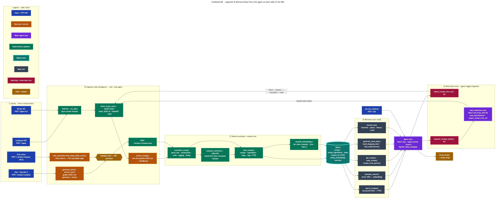

# Cookbook KB — Ingestion & Retrieval Data Flow

A single data-flow diagram of how recipes **enter** the knowledge base and how they
are **served back**, with the LLM/agent layer highlighted on **both sides of the
database**. Built for a technically-literate audience (architecture walkthrough / demo).

- Source (diagram-as-code): [`cookbook-dataflow.mmd`](cookbook-dataflow.mmd)
- Renders: [`cookbook-dataflow.png`](cookbook-dataflow.png) · [`cookbook-dataflow.svg`](cookbook-dataflow.svg)
- Re-render: `npx -y @mermaid-js/mermaid-cli -i cookbook-dataflow.mmd -o cookbook-dataflow.png -w 3000 --backgroundColor white`

## How to read it

The **SQLite store sits in the center**. Everything to its left **writes into it**
(ingestion); everything to its right **reads out of it** (retrieval). The long arcs
across the top are the **feedback loop**: the request-side agent can itself trigger
ingestion.

| Color | Meaning |
|---|---|
| 🔵 blue | Input / HTTP API surface |
| 🟠 orange | One-shot **LLM** call (guided-JSON extraction/generation) |
| 🟣 purple | **ReAct agent loop** (tool-calling) |
| 🟢 green | Deterministic Python pipeline |
| 🟦 teal | SQLite store (rows · FTS5 · vectors) |
| ⬛ slate | Read tool |
| 🔴 crimson | Mutating / write-back tool |
| 🟫 amber | Draft / answer |

## ① Four ways a recipe enters

| Input | Entry point | Path |
|---|---|---|
| **Cookbook PDF** | `POST /ingest` | async job → `loader.load()` (PyMuPDF + OCR) → extract → normalize → load |
| **Recipe URL** | `POST /ingest/url` | async job → `fetch_recipe_text()` (schema.org JSON-LD) → extract → normalize → load |
| **Vibe / describe it** | `POST /recipes/compose` | `_generate_draft()` guided-JSON LLM → editable **draft** → Save |
| **Find online** | `POST /recipes/compose` (`mode_hint=find`) | `web_researcher.find_recipe_draft_online()` (Brave) → editable **draft** → Save |

PDF/URL jobs **persist directly**. The two compose paths produce an **editable draft
that is *not* persisted** until `POST /recipes/compose/save`.

## ② The agent is used on BOTH sides

**Ingestion side** — the LLM does the *understanding*, never the math:
- `extract_recipe()` — a **one-shot guided-JSON** call (`eagle-nothink` via LiteLLM, `temperature=0`) turning messy page/PDF text into a typed `RawRecipe`. The LLM extracts the verbatim ingredient line + a clean food name; it does **not** parse quantities.
- `_generate_draft()` — same guided-JSON mechanism, but *generates/refines* a recipe from a free-text "vibe."
- **`web_researcher`** (its own subagent) appears twice:
  - `find_recipe_draft_online()` — single Brave search, walks the top results through `parse_recipe_from_url`, returns the first that parses (no persist).
  - `run()` — a **second ReAct loop** (`max_iters=8`, tools: Brave `web_search` + `import_recipe_from_url`) for open-ended "find me 5 high-protein dinners online" hunts that import each match.

**Request side** — `agent.run()` is the main **ReAct loop** (`eagle-nothink`, `temperature=0`). It is advertised only `RECIPE_TOOL_SCHEMAS` (10 recipe tools) to keep `/ask` fast, while the `TOOLS` dispatch map can still execute the full ~36 (recipe + harness) tools.

## ③ Shared normalize + embed core (deterministic)

All five paths converge here:
- `normalize_recipe()` — `parse_line` (deterministic qty/unit/grams) · canonicalize · unit standardization · diet/difficulty/course tagging · dedup fingerprint.
- `compute_nutrition()` — **USDA FDC** compute fallback: stated panel wins; otherwise nutrition is computed from matched foods (kept only if plausible).
- `load_recipes()` — writes `recipes`, `recipe_ingredients`, `steps`, `recipe_tags`, and the `recipes_fts` (FTS5) keyword row.
- `backfill_embeddings()` — `llm.client.embed()` (**jina, 1024-d**) over `title + description + cuisine + ingredients + tags`, stored as float32 BLOBs in `recipe_embeddings`.

## ④ Retrieval tools (read)

`agent.run()` answers by calling tools that read the store:
- `search_recipes()` — structured filter (calories/protein/time/diet/ingredient) → **FTS5**.
- `semantic_search()` — **the query-time use of embeddings**: embeds the query (`jina/1024`, LRU-cached) and does NumPy cosine kNN over `recipe_embeddings`.
- `get_recipe()` · `scale_recipe()` · `recipes_from_pantry()`.
- `generate_meal_plan()` · `build_shopping_list()` · `find_substitutions()`.
- harness tools (favorites · pantry · history · preferences) — mixed read/write of cook state.

→ output: a prose answer with tappable recipe-reference chips.

## ⑤ The feedback loop (write-back tools)

Two request-side tools let the agent **ingest mid-conversation**, closing the loop back
to the ingestion pipeline:
- `import_recipe_from_url()` — fetch → extract → normalize → **load** one URL.
- `research_recipes_online()` — delegates to the `web_researcher.run()` ReAct subagent, which imports each good match it finds on the web.

This is why the same embedding model + normalization core feeds both the writes and the
reads: a recipe the agent finds for you during `/ask` is normalized, nutrition-resolved,
and embedded exactly like one you ingested from a PDF.
